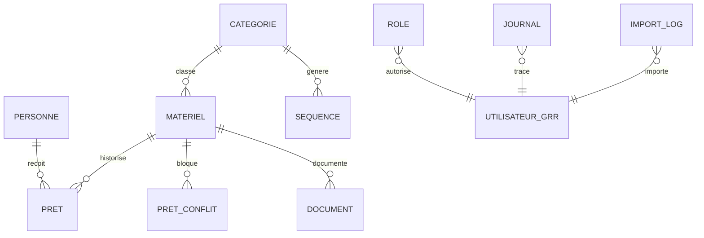

# Schema SQL propose pour le module Informatique materiel

Version de travail du 25 juin 2026.

Statut : proposition de l'etape 0 validee le 25 juin 2026. La version BDD 9
est implementee dans le module.

## 1. Conventions

- Le prefixe reel est fourni par `TABLE_PREFIX`.
- Les exemples utilisent le prefixe logique `grr`.
- Les tables du module utilisent `ENGINE=InnoDB`.
- L'encodage propose est `DEFAULT CHARSET=utf8`.
- Les cles primaires utilisent des entiers auto-incrementes.
- Les dates metier utilisent `DATE`.
- Les dates techniques utilisent un timestamp Unix `int(11)`.
- Les logins GRR utilisent `varchar(190)`.
- Les relations sont indexees.
- La premiere version n'ajoute pas de cles etrangeres SQL afin de rester proche
  des conventions des modules GRR existants.
- L'integrite relationnelle est controlee dans le repository et par le
  diagnostic administrateur.
- Aucun `DROP TABLE` ou `DROP COLUMN` automatique n'est prevu.

## 2. Relations logiques



Les tables GRR des utilisateurs ne sont pas liees par une cle etrangere. Le
login est conserve pour maintenir l'historique si un compte est desactive ou
supprime.

## 3. Tables proposees

### 3.1 Roles

Nom : `*_informatique_materiel_role`

```sql
CREATE TABLE IF NOT EXISTS `grr_informatique_materiel_role` (
    `id` int(11) NOT NULL AUTO_INCREMENT,
    `login` varchar(190) NOT NULL,
    `role` varchar(20) NOT NULL,
    `created_by` varchar(190) NOT NULL DEFAULT '',
    `created_at` int(11) NOT NULL DEFAULT 0,
    `updated_by` varchar(190) NOT NULL DEFAULT '',
    `updated_at` int(11) NOT NULL DEFAULT 0,
    PRIMARY KEY (`id`),
    UNIQUE KEY `login` (`login`),
    KEY `role` (`role`)
) ENGINE=InnoDB DEFAULT CHARSET=utf8;
```

Valeurs autorisees pour `role` :

- `lecteur` ;
- `operateur` ;
- `gestionnaire`.

L'administrateur general GRR n'a pas besoin d'une ligne dans cette table.

### 3.2 Journal

Nom : `*_informatique_materiel_journal`

```sql
CREATE TABLE IF NOT EXISTS `grr_informatique_materiel_journal` (
    `id` bigint(20) NOT NULL AUTO_INCREMENT,
    `type_evenement` varchar(50) NOT NULL,
    `type_objet` varchar(50) NOT NULL DEFAULT '',
    `objet_id` int(11) NOT NULL DEFAULT 0,
    `resume` text NULL,
    `login` varchar(190) NOT NULL DEFAULT '',
    `created_at` int(11) NOT NULL DEFAULT 0,
    PRIMARY KEY (`id`),
    KEY `type_evenement` (`type_evenement`),
    KEY `objet` (`type_objet`, `objet_id`),
    KEY `login` (`login`),
    KEY `created_at` (`created_at`)
) ENGINE=InnoDB DEFAULT CHARSET=utf8;
```

Le champ `resume` ne doit pas contenir de mot de passe, jeton ou contenu de
document.

### 3.3 Personnes

Nom : `*_informatique_materiel_personne`

```sql
CREATE TABLE IF NOT EXISTS `grr_informatique_materiel_personne` (
    `id` int(11) NOT NULL AUTO_INCREMENT,
    `legacy_id` int(11) NOT NULL DEFAULT 0,
    `identifiant_legacy` varchar(100) DEFAULT NULL,
    `prenom` varchar(100) NOT NULL,
    `nom` varchar(100) NOT NULL,
    `cadre_usage` varchar(100) NOT NULL DEFAULT '',
    `date_depart` date DEFAULT NULL,
    `login_grr` varchar(190) NOT NULL DEFAULT '',
    `email` varchar(190) NOT NULL DEFAULT '',
    `notes` text NULL,
    `actif` tinyint(1) NOT NULL DEFAULT 1,
    `created_by` varchar(190) NOT NULL DEFAULT '',
    `created_at` int(11) NOT NULL DEFAULT 0,
    `updated_by` varchar(190) NOT NULL DEFAULT '',
    `updated_at` int(11) NOT NULL DEFAULT 0,
    PRIMARY KEY (`id`),
    UNIQUE KEY `identifiant_legacy` (`identifiant_legacy`),
    KEY `legacy_id` (`legacy_id`),
    KEY `nom_prenom` (`nom`, `prenom`),
    KEY `cadre_usage` (`cadre_usage`),
    KEY `date_depart` (`date_depart`),
    KEY `login_grr` (`login_grr`),
    KEY `email` (`email`),
    KEY `actif` (`actif`)
) ENGINE=InnoDB DEFAULT CHARSET=utf8;
```

`identifiant_legacy` conserve l'identifiant Excel, par exemple `Bor_N_1`.
La valeur `NULL` permet de creer plusieurs personnes sans identifiant
historique lors de la saisie manuelle.

### 3.4 Categories

Nom : `*_informatique_materiel_categorie`

```sql
CREATE TABLE IF NOT EXISTS `grr_informatique_materiel_categorie` (
    `id` int(11) NOT NULL AUTO_INCREMENT,
    `prefixe` varchar(20) NOT NULL,
    `designation` varchar(190) NOT NULL,
    `description` text NULL,
    `actif` tinyint(1) NOT NULL DEFAULT 1,
    `created_by` varchar(190) NOT NULL DEFAULT '',
    `created_at` int(11) NOT NULL DEFAULT 0,
    `updated_by` varchar(190) NOT NULL DEFAULT '',
    `updated_at` int(11) NOT NULL DEFAULT 0,
    PRIMARY KEY (`id`),
    KEY `prefixe` (`prefixe`),
    KEY `designation` (`designation`),
    KEY `actif` (`actif`)
) ENGINE=InnoDB DEFAULT CHARSET=utf8;
```

Le prefixe n'est pas unique, car le classeur utilise par exemple `A` pour
plusieurs accessoires.

### 3.5 Sequences d'identifiants

Nom : `*_informatique_materiel_sequence`

```sql
CREATE TABLE IF NOT EXISTS `grr_informatique_materiel_sequence` (
    `id` int(11) NOT NULL AUTO_INCREMENT,
    `prefixe` varchar(20) NOT NULL,
    `dernier_numero` int(11) NOT NULL DEFAULT 0,
    `updated_by` varchar(190) NOT NULL DEFAULT '',
    `updated_at` int(11) NOT NULL DEFAULT 0,
    PRIMARY KEY (`id`),
    UNIQUE KEY `prefixe` (`prefixe`)
) ENGINE=InnoDB DEFAULT CHARSET=utf8;
```

La generation d'un identifiant verrouille la ligne du prefixe dans une
transaction, puis cree l'identifiant `prefixe_numero`.

### 3.6 Materiels

Nom : `*_informatique_materiel_item`

```sql
CREATE TABLE IF NOT EXISTS `grr_informatique_materiel_item` (
    `id` int(11) NOT NULL AUTO_INCREMENT,
    `identifiant` varchar(100) NOT NULL,
    `identifiant_legacy` varchar(100) DEFAULT NULL,
    `categorie_id` int(11) NOT NULL DEFAULT 0,
    `designation` varchar(190) NOT NULL,
    `precision_materiel` varchar(190) NOT NULL DEFAULT '',
    `mac` varchar(100) NOT NULL DEFAULT '',
    `marque` varchar(100) NOT NULL DEFAULT '',
    `numero_serie` varchar(190) NOT NULL DEFAULT '',
    `code_barre_usmb` varchar(100) DEFAULT NULL,
    `os` varchar(100) NOT NULL DEFAULT '',
    `annee` varchar(20) NOT NULL DEFAULT '',
    `commentaire` text NULL,
    `localisation_stockage` varchar(190) NOT NULL DEFAULT '',
    `statut` varchar(30) NOT NULL DEFAULT 'actif',
    `pret_multiple` tinyint(1) NOT NULL DEFAULT 0,
    `notes` text NULL,
    `actif` tinyint(1) NOT NULL DEFAULT 1,
    `created_by` varchar(190) NOT NULL DEFAULT '',
    `created_at` int(11) NOT NULL DEFAULT 0,
    `updated_by` varchar(190) NOT NULL DEFAULT '',
    `updated_at` int(11) NOT NULL DEFAULT 0,
    PRIMARY KEY (`id`),
    UNIQUE KEY `identifiant` (`identifiant`),
    UNIQUE KEY `identifiant_legacy` (`identifiant_legacy`),
    UNIQUE KEY `code_barre_usmb` (`code_barre_usmb`),
    KEY `categorie_id` (`categorie_id`),
    KEY `designation` (`designation`),
    KEY `marque` (`marque`),
    KEY `numero_serie` (`numero_serie`),
    KEY `mac` (`mac`),
    KEY `statut` (`statut`),
    KEY `pret_multiple` (`pret_multiple`),
    KEY `actif` (`actif`)
) ENGINE=InnoDB DEFAULT CHARSET=utf8;
```

`code_barre_usmb` utilise `NULL` lorsqu'il n'est pas renseigne afin que l'index
unique autorise plusieurs materiels sans code-barres.
`identifiant_legacy` utilise aussi `NULL` lorsqu'il n'est pas renseigne afin de
permettre plusieurs creations manuelles avant l'import historique.

Valeurs proposees pour `statut` :

- `actif` ;
- `stocke` ;
- `en_pret` ;
- `pret_multiple` ;
- `maintenance` ;
- `a_reformer` ;
- `archive`.

Le champ `pret_multiple` vaut `1` pour les materiels generiques pouvant etre
pretes simultanement a plusieurs personnes. Dans ce cas, plusieurs prets
ouverts sur le meme materiel ne sont pas consideres comme un conflit. Le statut
`pret_multiple` est applique automatiquement lorsqu'au moins deux prets ouverts
sont en cours sur ce type de materiel.

### 3.7 Prets

Nom : `*_informatique_materiel_pret`

```sql
CREATE TABLE IF NOT EXISTS `grr_informatique_materiel_pret` (
    `id` int(11) NOT NULL AUTO_INCREMENT,
    `personne_id` int(11) NOT NULL,
    `item_id` int(11) NOT NULL,
    `localisation` varchar(190) NOT NULL DEFAULT '',
    `date_debut` date NOT NULL,
    `date_fin_prevue` date DEFAULT NULL,
    `date_fin_effective` date DEFAULT NULL,
    `commentaire` text NULL,
    `statut` varchar(20) NOT NULL DEFAULT 'ouvert',
    `source_import_id` bigint(20) NOT NULL DEFAULT 0,
    `created_by` varchar(190) NOT NULL DEFAULT '',
    `created_at` int(11) NOT NULL DEFAULT 0,
    `updated_by` varchar(190) NOT NULL DEFAULT '',
    `updated_at` int(11) NOT NULL DEFAULT 0,
    PRIMARY KEY (`id`),
    KEY `personne_id` (`personne_id`),
    KEY `item_id` (`item_id`),
    KEY `statut` (`statut`),
    KEY `date_debut` (`date_debut`),
    KEY `date_fin_prevue` (`date_fin_prevue`),
    KEY `date_fin_effective` (`date_fin_effective`)
) ENGINE=InnoDB DEFAULT CHARSET=utf8;
```

La contrainte "un seul pret ouvert par materiel" est controlee par transaction
applicative pour les materiels non generiques. Les materiels dont
`pret_multiple = 1` peuvent avoir plusieurs prets ouverts simultanement.

### 3.8 Documents

Nom : `*_informatique_materiel_document`

```sql
CREATE TABLE IF NOT EXISTS `grr_informatique_materiel_document` (
    `id` int(11) NOT NULL AUTO_INCREMENT,
    `item_id` int(11) NOT NULL,
    `type_document` varchar(50) NOT NULL DEFAULT 'autre',
    `description` text NULL,
    `original_name` varchar(255) NOT NULL DEFAULT '',
    `stored_name` char(64) NOT NULL,
    `mime_type` varchar(190) NOT NULL DEFAULT 'application/octet-stream',
    `taille` int(11) NOT NULL DEFAULT 0,
    `sha256` char(64) NOT NULL DEFAULT '',
    `actif` tinyint(1) NOT NULL DEFAULT 1,
    `uploaded_by` varchar(190) NOT NULL DEFAULT '',
    `created_at` int(11) NOT NULL DEFAULT 0,
    `archived_by` varchar(190) NOT NULL DEFAULT '',
    `archived_at` int(11) NOT NULL DEFAULT 0,
    PRIMARY KEY (`id`),
    UNIQUE KEY `stored_name` (`stored_name`),
    KEY `item_id` (`item_id`),
    KEY `type_document` (`type_document`),
    KEY `sha256` (`sha256`),
    KEY `actif` (`actif`),
    KEY `created_at` (`created_at`)
) ENGINE=InnoDB DEFAULT CHARSET=utf8;
```

Types proposes :

`facture`, `bon_livraison`, `notice`, `garantie`, `intervention`, `photo`,
`autre`.

### 3.9 Conflits de prets importes

Nom : `*_informatique_materiel_pret_conflit`

```sql
CREATE TABLE IF NOT EXISTS `grr_informatique_materiel_pret_conflit` (
    `id` bigint(20) NOT NULL AUTO_INCREMENT,
    `package_hash` char(64) NOT NULL DEFAULT '',
    `package_name` varchar(190) NOT NULL DEFAULT '',
    `source_table` varchar(50) NOT NULL DEFAULT 'loans',
    `source_row` int(11) NOT NULL DEFAULT 0,
    `motif` varchar(100) NOT NULL DEFAULT '',
    `statut` varchar(20) NOT NULL DEFAULT 'en_attente',
    `personne_id` int(11) NOT NULL DEFAULT 0,
    `item_id` int(11) NOT NULL DEFAULT 0,
    `pret_existant_id` int(11) NOT NULL DEFAULT 0,
    `localisation` varchar(190) NOT NULL DEFAULT '',
    `date_debut` date DEFAULT NULL,
    `date_fin_prevue` date DEFAULT NULL,
    `date_fin_effective` date DEFAULT NULL,
    `commentaire` text NULL,
    `resume_source` text NULL,
    `decision` text NULL,
    `created_by` varchar(190) NOT NULL DEFAULT '',
    `created_at` int(11) NOT NULL DEFAULT 0,
    `resolved_by` varchar(190) NOT NULL DEFAULT '',
    `resolved_at` int(11) NOT NULL DEFAULT 0,
    PRIMARY KEY (`id`),
    UNIQUE KEY `package_source_row` (`package_hash`, `source_table`, `source_row`),
    KEY `statut` (`statut`),
    KEY `item_id` (`item_id`),
    KEY `personne_id` (`personne_id`),
    KEY `pret_existant_id` (`pret_existant_id`),
    KEY `created_at` (`created_at`)
) ENGINE=InnoDB DEFAULT CHARSET=utf8;
```

Cette table conserve les lignes importees qui entrent en conflit avec un pret
ouvert deja present. La nouvelle entree reste en `en_attente` et ne modifie pas
le pret existant tant qu'une decision de resolution n'a pas ete prise.

### 3.10 Journal des imports

Nom : `*_informatique_materiel_import_log`

```sql
CREATE TABLE IF NOT EXISTS `grr_informatique_materiel_import_log` (
    `id` bigint(20) NOT NULL AUTO_INCREMENT,
    `package_hash` char(64) NOT NULL,
    `package_name` varchar(190) NOT NULL DEFAULT '',
    `source_table` varchar(50) NOT NULL DEFAULT '',
    `source_row` int(11) NOT NULL,
    `personne_id` int(11) NOT NULL DEFAULT 0,
    `item_id` int(11) NOT NULL DEFAULT 0,
    `pret_id` int(11) NOT NULL DEFAULT 0,
    `status` varchar(20) NOT NULL DEFAULT 'success',
    `message` text NULL,
    `created_by` varchar(190) NOT NULL DEFAULT '',
    `created_at` int(11) NOT NULL DEFAULT 0,
    PRIMARY KEY (`id`),
    UNIQUE KEY `package_source_row` (`package_hash`, `source_table`, `source_row`),
    KEY `package_name` (`package_name`),
    KEY `source_table` (`source_table`),
    KEY `status` (`status`),
    KEY `created_at` (`created_at`)
) ENGINE=InnoDB DEFAULT CHARSET=utf8;
```

Le couple empreinte du paquet, table source et ligne source rend l'import
rejouable sans dupliquer les lignes deja acceptees.

## 4. Parametres GRR

Les parametres suivants seront stockes dans `*_setting`. Leur nom reste sous la
limite de 32 caracteres imposee par GRR.

| Nom | Valeur par defaut | Usage |
|---|---|---|
| `imat_enabled` | `1` | Activation fonctionnelle |
| `imat_display_name` | `Informatique materiel` | Nom affiche |
| `imat_docs_enabled` | `1` | Depot de documents |
| `imat_docs_mb` | `10` | Taille maximale |
| `imat_docs_ext` | liste blanche | Extensions autorisees |
| `imat_alerts_enabled` | `1` | Activation des alertes |
| `imat_depart_days` | `30` | Delai d'alerte depart proche |
| `imat_conflict_banner_enabled` | `1` | Affichage du bandeau conflits en haut du module |
| `imat_alert_danger_color` | `#c9302c` | Couleur des alertes critiques |
| `imat_alert_warning_color` | `#f0ad4e` | Couleur des alertes d'avertissement |
| `imat_conflict_alert_color` | `#8a6d3b` | Couleur du bandeau conflits |

Les roles ne sont pas stockes dans les parametres, car une table dediee est
plus adaptee aux niveaux d'autorisation et a leur journalisation.

## 5. Strategie de migration

### Version BDD 1 - Socle

- table des roles ;
- table du journal ;
- parametres initiaux ;
- diagnostic technique.

### Version BDD 2 - Referentiels

- personnes ;
- categories ;
- sequences d'identifiants.

### Version BDD 3 - Materiels

- table des materiels ;
- saisie, fiche, export et diagnostic des doublons.

### Version BDD 4 - Prets

- table des prets ;
- controle des prets ouverts ;
- restitution et annulation ;
- historique et export CSV ;
- alertes de retard.

### Version BDD 5 - Import initial

- table du journal des imports ;
- previsualisation et journalisation ligne par ligne ;
- aucun remplacement silencieux des donnees existantes.

### Version BDD 6 - Documents

- table des documents ;
- repertoire protege ;
- parametres d'upload.

### Version BDD 7 - Conflits de prets importes

- table des conflits de prets ;
- statut d'import `conflict` pour les doublons conserves a part ;
- aucune modification du pret ouvert existant tant qu'une decision de resolution
  n'est pas prise.

### Version BDD 8 - Email personnes

- ajout de la colonne `email` dans les personnes ;
- index `email` ;
- alimentation possible depuis l'annuaire LDAP lors des associations.

### Version BDD 9 - Prets multiples generiques

- ajout de la colonne `pret_multiple` dans les materiels ;
- index `pret_multiple` ;
- autorisation de plusieurs prets ouverts pour les materiels generiques ;
- statut automatique `pret_multiple` lorsqu'au moins deux prets ouverts sont
  en cours sur le meme materiel generique.

## 6. Regles d'execution des migrations

1. lire la version actuelle dans `*_modulesext` ;
2. considerer une nouvelle installation comme version 0 ;
3. executer les migrations manquantes dans l'ordre ;
4. rendre chaque migration rejouable ;
5. verifier le resultat de chaque commande SQL ;
6. mettre a jour `*_modulesext.version` seulement apres succes ;
7. interrompre l'installation sur la premiere erreur ;
8. ne jamais supprimer automatiquement une table, colonne ou donnee ;
9. documenter toute migration dans le `README.md` et la roadmap ;
10. sauvegarder avant une migration contenant un `ALTER TABLE`.

Une migration echouee doit pouvoir etre relancee apres correction sans doubler
les donnees.

## 7. Transactions

Les operations de pret et de generation d'identifiant doivent etre atomiques.
Les transactions utiliseront la connexion `mysqli` disponible dans
`$GLOBALS['db_c']`, comme dans `stock_chimique`.

```php
$db = $GLOBALS['db_c'];
$db->begin_transaction();

try {
    // SELECT ... FOR UPDATE
    // verification droits et metier
    // INSERT / UPDATE
    // INSERT journal
    $db->commit();
} catch (Throwable $exception) {
    $db->rollback();
    throw $exception;
}
```

Le code reel devra aussi verifier les valeurs de retour des helpers GRR, qui
peuvent retourner `-1` ou `0` sans lever d'exception.

## 8. Diagnostics SQL prevus

### Prets ouverts multiples pour un materiel

```sql
SELECT item_id, COUNT(*) AS nombre
FROM grr_informatique_materiel_pret
WHERE statut = 'ouvert'
GROUP BY item_id
HAVING COUNT(*) > 1;
```

### Prets sans personne

```sql
SELECT p.id, p.personne_id
FROM grr_informatique_materiel_pret p
LEFT JOIN grr_informatique_materiel_personne pe ON pe.id = p.personne_id
WHERE pe.id IS NULL;
```

### Prets sans materiel

```sql
SELECT p.id, p.item_id
FROM grr_informatique_materiel_pret p
LEFT JOIN grr_informatique_materiel_item i ON i.id = p.item_id
WHERE i.id IS NULL;
```

### Materiels sans categorie

```sql
SELECT i.id, i.identifiant, i.designation
FROM grr_informatique_materiel_item i
LEFT JOIN grr_informatique_materiel_categorie c ON c.id = i.categorie_id
WHERE i.actif = 1
  AND c.id IS NULL;
```

### Codes-barres dupliques

```sql
SELECT code_barre_usmb, COUNT(*) AS nombre
FROM grr_informatique_materiel_item
WHERE code_barre_usmb IS NOT NULL
  AND code_barre_usmb <> ''
GROUP BY code_barre_usmb
HAVING COUNT(*) > 1;
```

### MAC dupliquees a verifier

```sql
SELECT mac, COUNT(*) AS nombre
FROM grr_informatique_materiel_item
WHERE mac <> ''
GROUP BY mac
HAVING COUNT(*) > 1;
```

### Numeros de serie dupliques a verifier

```sql
SELECT numero_serie, COUNT(*) AS nombre
FROM grr_informatique_materiel_item
WHERE numero_serie <> ''
GROUP BY numero_serie
HAVING COUNT(*) > 1;
```

### Prets en retard

```sql
SELECT p.id, i.identifiant, pe.nom, pe.prenom, p.date_fin_prevue
FROM grr_informatique_materiel_pret p
JOIN grr_informatique_materiel_item i ON i.id = p.item_id
JOIN grr_informatique_materiel_personne pe ON pe.id = p.personne_id
WHERE p.statut = 'ouvert'
  AND p.date_fin_prevue IS NOT NULL
  AND p.date_fin_prevue < CURRENT_DATE();
```

### Personnes parties avec pret ouvert

```sql
SELECT pe.id, pe.nom, pe.prenom, i.identifiant, pe.date_depart
FROM grr_informatique_materiel_personne pe
JOIN grr_informatique_materiel_pret p ON p.personne_id = pe.id
JOIN grr_informatique_materiel_item i ON i.id = p.item_id
WHERE pe.date_depart IS NOT NULL
  AND pe.date_depart < CURRENT_DATE()
  AND p.statut = 'ouvert';
```

## 9. Risques techniques du schema

### InnoDB different de `gestion_materiel`

`gestion_materiel` utilise MyISAM. InnoDB est propose ici pour garantir
l'atomicite des prets et de la generation d'identifiants. La creation, les
transactions et les diagnostics devront etre testes sur MariaDB 10 avant
d'implementer les prets.

### Absence de cles etrangeres SQL

Ce choix ameliore la compatibilite avec les conventions existantes, mais impose
des controles applicatifs et des diagnostics d'orphelins. Une reevaluation sera
possible apres la recette du socle.

### Disponibilite calculee

La disponibilite depend des prets ouverts. Cela evite de stocker une valeur
contradictoire, mais impose des requetes correctement indexees.

### Identifiants historiques

Les identifiants Excel doivent etre conserves pour la recette. Une fois le MVP
stabilise, ils resteront utiles comme reference d'audit.

### Donnees partiellement uniques

Le numero de serie et la MAC peuvent contenir des doublons historiques. Le
module doit les signaler sans bloquer l'import initial, sauf validation
contraire pendant la recette.
