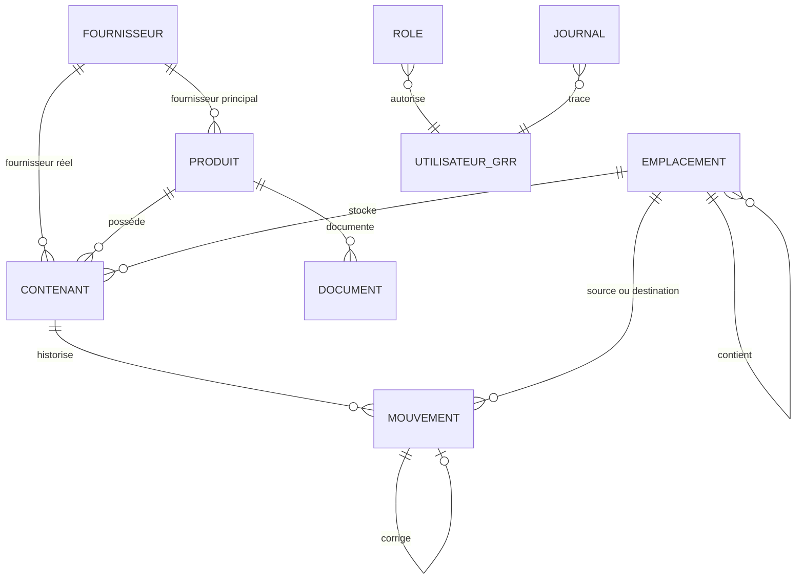

# Schéma SQL proposé pour le module Stock chimique

Version de travail du 19 juin 2026.

Statut : proposition issue de l’étape 0. Ce document ne constitue pas encore
une migration exécutable.

## 1. Conventions

- Le préfixe réel est fourni par `TABLE_PREFIX`.
- Les exemples utilisent le préfixe logique `grr`.
- Les tables du module utilisent `ENGINE=InnoDB`.
- L’encodage proposé est `DEFAULT CHARSET=utf8`.
- Les clés primaires utilisent des entiers auto-incrémentés.
- Les dates métier sans heure utilisent `DATE`.
- Les dates techniques utilisent un timestamp Unix `int(11)`.
- Les quantités utilisent `DECIMAL(15,4)`.
- Les logins GRR utilisent `varchar(190)`.
- Les relations sont indexées.
- La première version n’ajoute pas de clés étrangères SQL afin de rester proche
  des conventions des modules GRR existants.
- L’intégrité relationnelle est contrôlée dans le repository et par le
  diagnostic administrateur.
- Aucun `DROP TABLE` ou `DROP COLUMN` automatique n’est prévu.

## 2. Relations logiques



Les tables GRR des utilisateurs ne sont pas liées par une clé étrangère. Le
login est conservé pour maintenir l’historique si un compte est désactivé ou
supprimé.

## 3. Tables de la version initiale

### 3.1 Rôles

Nom : `*_stock_chimique_role`

```sql
CREATE TABLE IF NOT EXISTS `grr_stock_chimique_role` (
    `id` int(11) NOT NULL AUTO_INCREMENT,
    `login` varchar(190) NOT NULL,
    `role` varchar(20) NOT NULL,
    `created_by` varchar(190) NOT NULL DEFAULT '',
    `created_at` int(11) NOT NULL DEFAULT 0,
    `updated_by` varchar(190) NOT NULL DEFAULT '',
    `updated_at` int(11) NOT NULL DEFAULT 0,
    PRIMARY KEY (`id`),
    UNIQUE KEY `login` (`login`),
    KEY `role` (`role`)
) ENGINE=InnoDB DEFAULT CHARSET=utf8;
```

Valeurs autorisées pour `role` :

- `lecteur` ;
- `operateur` ;
- `gestionnaire`.

L’administrateur général GRR n’a pas besoin d’une ligne dans cette table.

### 3.2 Journal

Nom : `*_stock_chimique_journal`

```sql
CREATE TABLE IF NOT EXISTS `grr_stock_chimique_journal` (
    `id` bigint(20) NOT NULL AUTO_INCREMENT,
    `type_evenement` varchar(50) NOT NULL,
    `type_objet` varchar(50) NOT NULL DEFAULT '',
    `objet_id` int(11) NOT NULL DEFAULT 0,
    `resume` text NULL,
    `login` varchar(190) NOT NULL DEFAULT '',
    `created_at` int(11) NOT NULL DEFAULT 0,
    PRIMARY KEY (`id`),
    KEY `type_evenement` (`type_evenement`),
    KEY `objet` (`type_objet`, `objet_id`),
    KEY `login` (`login`),
    KEY `created_at` (`created_at`)
) ENGINE=InnoDB DEFAULT CHARSET=utf8;
```

Le champ `resume` ne doit pas contenir de mot de passe, jeton, contenu de FDS ou
autre donnée technique sensible.

### 3.3 Fournisseurs

Nom : `*_stock_chimique_fournisseur`

```sql
CREATE TABLE IF NOT EXISTS `grr_stock_chimique_fournisseur` (
    `id` int(11) NOT NULL AUTO_INCREMENT,
    `nom` varchar(190) NOT NULL,
    `adresse` text NULL,
    `contact` varchar(190) NOT NULL DEFAULT '',
    `telephone` varchar(50) NOT NULL DEFAULT '',
    `email` varchar(190) NOT NULL DEFAULT '',
    `site_web` varchar(255) NOT NULL DEFAULT '',
    `notes` text NULL,
    `actif` tinyint(1) NOT NULL DEFAULT 1,
    `created_by` varchar(190) NOT NULL DEFAULT '',
    `created_at` int(11) NOT NULL DEFAULT 0,
    `updated_by` varchar(190) NOT NULL DEFAULT '',
    `updated_at` int(11) NOT NULL DEFAULT 0,
    PRIMARY KEY (`id`),
    KEY `nom` (`nom`),
    KEY `actif` (`actif`)
) ENGINE=InnoDB DEFAULT CHARSET=utf8;
```

Le doublon de nom est contrôlé par l’application afin de permettre, si
nécessaire, deux établissements portant un nom proche.

### 3.4 Emplacements

Nom : `*_stock_chimique_emplacement`

```sql
CREATE TABLE IF NOT EXISTS `grr_stock_chimique_emplacement` (
    `id` int(11) NOT NULL AUTO_INCREMENT,
    `parent_id` int(11) NOT NULL DEFAULT 0,
    `code` varchar(100) NOT NULL,
    `nom` varchar(190) NOT NULL,
    `type_emplacement` varchar(30) NOT NULL DEFAULT 'autre',
    `responsable` varchar(190) NOT NULL DEFAULT '',
    `description` text NULL,
    `actif` tinyint(1) NOT NULL DEFAULT 1,
    `created_by` varchar(190) NOT NULL DEFAULT '',
    `created_at` int(11) NOT NULL DEFAULT 0,
    `updated_by` varchar(190) NOT NULL DEFAULT '',
    `updated_at` int(11) NOT NULL DEFAULT 0,
    PRIMARY KEY (`id`),
    UNIQUE KEY `code` (`code`),
    KEY `parent_id` (`parent_id`),
    KEY `type_emplacement` (`type_emplacement`),
    KEY `actif` (`actif`)
) ENGINE=InnoDB DEFAULT CHARSET=utf8;
```

Valeurs proposées pour `type_emplacement` :

`site`, `batiment`, `local`, `armoire`, `refrigerateur`, `etagere`, `autre`.

`parent_id = 0` signifie que l’emplacement est à la racine.

### 3.5 Produits

Nom : `*_stock_chimique_produit`

```sql
CREATE TABLE IF NOT EXISTS `grr_stock_chimique_produit` (
    `id` int(11) NOT NULL AUTO_INCREMENT,
    `reference_interne` varchar(100) DEFAULT NULL,
    `nom_commercial` varchar(190) NOT NULL,
    `fournisseur_id` int(11) NOT NULL DEFAULT 0,
    `reference_fournisseur` varchar(100) NOT NULL DEFAULT '',
    `fabricant` varchar(190) NOT NULL DEFAULT '',
    `numero_cas` varchar(190) NOT NULL DEFAULT '',
    `numero_ce` varchar(50) NOT NULL DEFAULT '',
    `ufi` varchar(50) NOT NULL DEFAULT '',
    `etat_physique` varchar(30) NOT NULL DEFAULT 'non_renseigne',
    `unite_stock` varchar(10) NOT NULL,
    `categorie` varchar(100) NOT NULL DEFAULT '',
    `pictogrammes_clp` varchar(255) NOT NULL DEFAULT '',
    `mentions_h` text NULL,
    `conseils_p` text NULL,
    `statut_cmr` varchar(20) NOT NULL DEFAULT 'non_renseigne',
    `conditions_stockage` text NULL,
    `seuil_minimal` decimal(15,4) NOT NULL DEFAULT 0.0000,
    `description` text NULL,
    `notes` text NULL,
    `actif` tinyint(1) NOT NULL DEFAULT 1,
    `created_by` varchar(190) NOT NULL DEFAULT '',
    `created_at` int(11) NOT NULL DEFAULT 0,
    `updated_by` varchar(190) NOT NULL DEFAULT '',
    `updated_at` int(11) NOT NULL DEFAULT 0,
    PRIMARY KEY (`id`),
    UNIQUE KEY `reference_interne` (`reference_interne`),
    KEY `nom_commercial` (`nom_commercial`),
    KEY `fournisseur_id` (`fournisseur_id`),
    KEY `fabricant` (`fabricant`),
    KEY `numero_cas` (`numero_cas`),
    KEY `categorie` (`categorie`),
    KEY `statut_cmr` (`statut_cmr`),
    KEY `actif` (`actif`)
) ENGINE=InnoDB DEFAULT CHARSET=utf8;
```

Valeurs proposées :

- `etat_physique` : `non_renseigne`, `solide`, `liquide`, `gaz`, `autre` ;
- `unite_stock` : `mg`, `g`, `kg`, `ml`, `l`, `unite` ;
- `statut_cmr` : `non_renseigne`, `non`, `oui`.

La référence interne utilise `NULL` lorsqu’elle n’est pas renseignée afin que
l’index unique autorise plusieurs produits sans référence.

### 3.6 Contenants

Nom : `*_stock_chimique_contenant`

```sql
CREATE TABLE IF NOT EXISTS `grr_stock_chimique_contenant` (
    `id` int(11) NOT NULL AUTO_INCREMENT,
    `produit_id` int(11) NOT NULL,
    `fournisseur_id` int(11) NOT NULL DEFAULT 0,
    `emplacement_id` int(11) NOT NULL,
    `code_interne` varchar(100) NOT NULL,
    `numero_lot` varchar(100) NOT NULL DEFAULT '',
    `conditionnement` varchar(190) NOT NULL DEFAULT '',
    `quantite_courante` decimal(15,4) NOT NULL DEFAULT 0.0000,
    `unite` varchar(10) NOT NULL,
    `date_reception` date DEFAULT NULL,
    `date_ouverture` date DEFAULT NULL,
    `date_peremption` date DEFAULT NULL,
    `statut` varchar(20) NOT NULL DEFAULT 'en_stock',
    `notes` text NULL,
    `created_by` varchar(190) NOT NULL DEFAULT '',
    `created_at` int(11) NOT NULL DEFAULT 0,
    `updated_by` varchar(190) NOT NULL DEFAULT '',
    `updated_at` int(11) NOT NULL DEFAULT 0,
    PRIMARY KEY (`id`),
    UNIQUE KEY `code_interne` (`code_interne`),
    KEY `produit_id` (`produit_id`),
    KEY `fournisseur_id` (`fournisseur_id`),
    KEY `emplacement_id` (`emplacement_id`),
    KEY `numero_lot` (`numero_lot`),
    KEY `date_peremption` (`date_peremption`),
    KEY `statut` (`statut`),
    KEY `produit_statut` (`produit_id`, `statut`)
) ENGINE=InnoDB DEFAULT CHARSET=utf8;
```

Valeurs proposées pour `statut` :

`en_stock`, `vide`, `elimine`, `retourne`, `archive`.

### 3.7 Mouvements

Nom : `*_stock_chimique_mouvement`

```sql
CREATE TABLE IF NOT EXISTS `grr_stock_chimique_mouvement` (
    `id` bigint(20) NOT NULL AUTO_INCREMENT,
    `contenant_id` int(11) NOT NULL,
    `type_mouvement` varchar(30) NOT NULL,
    `quantite` decimal(15,4) NOT NULL DEFAULT 0.0000,
    `quantite_avant` decimal(15,4) NOT NULL DEFAULT 0.0000,
    `quantite_apres` decimal(15,4) NOT NULL DEFAULT 0.0000,
    `unite` varchar(10) NOT NULL,
    `emplacement_source_id` int(11) NOT NULL DEFAULT 0,
    `emplacement_destination_id` int(11) NOT NULL DEFAULT 0,
    `mouvement_source_id` bigint(20) NOT NULL DEFAULT 0,
    `motif` text NULL,
    `date_effective` int(11) NOT NULL DEFAULT 0,
    `request_token` char(64) NOT NULL,
    `created_by` varchar(190) NOT NULL DEFAULT '',
    `created_at` int(11) NOT NULL DEFAULT 0,
    PRIMARY KEY (`id`),
    UNIQUE KEY `request_token` (`request_token`),
    KEY `contenant_id` (`contenant_id`),
    KEY `type_mouvement` (`type_mouvement`),
    KEY `emplacement_source_id` (`emplacement_source_id`),
    KEY `emplacement_destination_id` (`emplacement_destination_id`),
    KEY `mouvement_source_id` (`mouvement_source_id`),
    KEY `date_effective` (`date_effective`),
    KEY `created_by` (`created_by`)
) ENGINE=InnoDB DEFAULT CHARSET=utf8;
```

Valeurs proposées pour `type_mouvement` :

- `entree` ;
- `consommation` ;
- `transfert` ;
- `correction_plus` ;
- `correction_moins` ;
- `elimination` ;
- `retour_fournisseur`.

La quantité est toujours positive. Le type détermine son effet. Pour un
transfert, `quantite_avant` et `quantite_apres` sont identiques.

### 3.8 Documents

Nom : `*_stock_chimique_document`

```sql
CREATE TABLE IF NOT EXISTS `grr_stock_chimique_document` (
    `id` int(11) NOT NULL AUTO_INCREMENT,
    `produit_id` int(11) NOT NULL,
    `type_document` varchar(30) NOT NULL DEFAULT 'autre',
    `langue` varchar(10) NOT NULL DEFAULT 'fr',
    `emetteur` varchar(190) NOT NULL DEFAULT '',
    `date_revision` date DEFAULT NULL,
    `numero_version` varchar(100) NOT NULL DEFAULT '',
    `est_courant` tinyint(1) NOT NULL DEFAULT 0,
    `description` text NULL,
    `original_name` varchar(255) NOT NULL,
    `stored_name` char(64) NOT NULL,
    `mime_type` varchar(190) NOT NULL DEFAULT 'application/octet-stream',
    `taille` int(11) NOT NULL DEFAULT 0,
    `sha256` char(64) NOT NULL,
    `actif` tinyint(1) NOT NULL DEFAULT 1,
    `uploaded_by` varchar(190) NOT NULL DEFAULT '',
    `created_at` int(11) NOT NULL DEFAULT 0,
    `fds_validated_by` varchar(190) NOT NULL DEFAULT '',
    `fds_validated_at` int(11) NOT NULL DEFAULT 0,
    `archived_by` varchar(190) NOT NULL DEFAULT '',
    `archived_at` int(11) NOT NULL DEFAULT 0,
    PRIMARY KEY (`id`),
    UNIQUE KEY `stored_name` (`stored_name`),
    KEY `produit_id` (`produit_id`),
    KEY `type_document` (`type_document`),
    KEY `date_revision` (`date_revision`),
    KEY `fds_courante` (`produit_id`, `type_document`, `langue`, `est_courant`),
    KEY `sha256` (`sha256`),
    KEY `actif` (`actif`)
) ENGINE=InnoDB DEFAULT CHARSET=utf8;
```

Valeurs proposées pour `type_document` :

`fds`, `certificat_analyse`, `fiche_technique`, `mode_operatoire`, `notice`,
`etiquette`, `autre`.

L’unicité d’une FDS courante par produit et langue est contrôlée dans une
transaction. Un index unique direct ne convient pas, car il empêcherait aussi
de conserver plusieurs anciennes versions avec `est_courant = 0`.

`fds_validated_at` et `fds_validated_by` enregistrent le dernier contrôle
interne effectué par un gestionnaire du module ou un administrateur GRR. Ils ne remplacent jamais
`date_revision`, qui reste la date indiquée par l’émetteur de la FDS.

### 3.9 Inventaires

Nom : `*_stock_chimique_inventaire`

```sql
CREATE TABLE IF NOT EXISTS `grr_stock_chimique_inventaire` (
    `id` int(11) NOT NULL AUTO_INCREMENT,
    `libelle` varchar(190) NOT NULL,
    `emplacement_id` int(11) NOT NULL DEFAULT 0,
    `statut` varchar(20) NOT NULL DEFAULT 'ouvert',
    `opened_by` varchar(190) NOT NULL DEFAULT '',
    `opened_at` int(11) NOT NULL DEFAULT 0,
    `completed_by` varchar(190) NOT NULL DEFAULT '',
    `completed_at` int(11) NOT NULL DEFAULT 0,
    PRIMARY KEY (`id`),
    KEY `emplacement_id` (`emplacement_id`),
    KEY `statut` (`statut`),
    KEY `opened_at` (`opened_at`)
) ENGINE=InnoDB DEFAULT CHARSET=utf8;
```

Valeurs applicatives prévues pour `statut` : `ouvert`, `termine`, `annule`.
Un inventaire annulé conserve ses lignes en consultation mais n’applique aucune
correction de stock.

### 3.10 Lignes d’inventaire

Nom : `*_stock_chimique_inventaire_ligne`

```sql
CREATE TABLE IF NOT EXISTS `grr_stock_chimique_inventaire_ligne` (
    `id` int(11) NOT NULL AUTO_INCREMENT,
    `inventaire_id` int(11) NOT NULL,
    `contenant_id` int(11) NOT NULL,
    `quantite_attendue` decimal(15,4) NOT NULL DEFAULT 0.0000,
    `quantite_comptee` decimal(15,4) DEFAULT NULL,
    `ecart` decimal(15,4) DEFAULT NULL,
    `dernier_mouvement_id` bigint(20) NOT NULL DEFAULT 0,
    `statut` varchar(20) NOT NULL DEFAULT 'a_compter',
    `commentaire` text NULL,
    `updated_by` varchar(190) NOT NULL DEFAULT '',
    `updated_at` int(11) NOT NULL DEFAULT 0,
    PRIMARY KEY (`id`),
    UNIQUE KEY `inventaire_contenant` (`inventaire_id`, `contenant_id`),
    KEY `inventaire_id` (`inventaire_id`),
    KEY `contenant_id` (`contenant_id`),
    KEY `statut` (`statut`)
) ENGINE=InnoDB DEFAULT CHARSET=utf8;
```

Le dernier mouvement connu est mémorisé à l’ouverture. Une différence au
moment de la clôture signale un conflit et interdit une correction silencieuse.

### 3.11 Journal des notifications

Nom : `*_stock_chimique_notification_log`

```sql
CREATE TABLE IF NOT EXISTS `grr_stock_chimique_notification_log` (
    `id` bigint(20) NOT NULL AUTO_INCREMENT,
    `alert_key` char(64) NOT NULL,
    `login` varchar(190) NOT NULL,
    `type_notification` varchar(50) NOT NULL,
    `objet_id` int(11) NOT NULL DEFAULT 0,
    `sent_at` int(11) NOT NULL DEFAULT 0,
    `status` varchar(20) NOT NULL DEFAULT 'sent',
    `message` text NULL,
    PRIMARY KEY (`id`),
    UNIQUE KEY `alert_login` (`alert_key`, `login`),
    KEY `type_notification` (`type_notification`),
    KEY `objet_id` (`objet_id`),
    KEY `sent_at` (`sent_at`)
) ENGINE=InnoDB DEFAULT CHARSET=utf8;
```

`alert_key` contient une empreinte SHA-256 de la clé fonctionnelle de l’alerte.
Cette longueur permet à l’index composite de rester compatible avec les limites
InnoDB des installations MariaDB plus anciennes.

### 3.12 Journal des imports

Nom : `*_stock_chimique_import_log`

```sql
CREATE TABLE IF NOT EXISTS `grr_stock_chimique_import_log` (
    `id` bigint(20) NOT NULL AUTO_INCREMENT,
    `package_hash` char(64) NOT NULL,
    `package_name` varchar(190) NOT NULL DEFAULT '',
    `source_row` int(11) NOT NULL,
    `product_id` int(11) NOT NULL DEFAULT 0,
    `container_id` int(11) NOT NULL DEFAULT 0,
    `document_id` int(11) NOT NULL DEFAULT 0,
    `status` varchar(20) NOT NULL DEFAULT 'success',
    `message` text NULL,
    `created_by` varchar(190) NOT NULL DEFAULT '',
    `created_at` int(11) NOT NULL DEFAULT 0,
    PRIMARY KEY (`id`),
    UNIQUE KEY `package_row` (`package_hash`, `source_row`),
    KEY `package_name` (`package_name`),
    KEY `status` (`status`),
    KEY `created_at` (`created_at`)
) ENGINE=InnoDB DEFAULT CHARSET=utf8;
```

Le couple empreinte du CSV / ligne source rend l’exécution du même paquet
rejouable. Les identifiants créés permettent de diagnostiquer une reprise
partielle sans supprimer les données déjà enregistrées.

## 4. Paramètres GRR

Les paramètres suivants seront stockés dans `*_setting`. Leur nom reste sous la
limite de 32 caractères imposée par GRR.

| Nom | Valeur par défaut | Usage |
|---|---|---|
| `schim_enabled` | `1` | Activation fonctionnelle |
| `schim_display_name` | `Stock chimique` | Nom affiché |
| `schim_alerts_enabled` | `1` | Activation globale des alertes |
| `schim_alert_stock` | `1` | Alertes de stock faible |
| `schim_alert_expiry` | `1` | Alertes de péremption |
| `schim_alert_fds` | `1` | Alertes de FDS |
| `schim_expiry_days` | `90` | Péremption proche |
| `schim_fds_months` | `36` | FDS à vérifier |
| `schim_docs_enabled` | `1` | Dépôt de documents |
| `schim_docs_mb` | `10` | Taille maximale |
| `schim_docs_ext` | liste blanche | Extensions hors FDS |
| `schim_notif_enabled` | `1` | Activation des notifications électroniques |
| `schim_notif_token` | vide | Tâche planifiée future |

Les rôles ne sont pas stockés dans les paramètres, car une table dédiée est
plus adaptée aux trois niveaux d’autorisation et à leur journalisation.

## 5. Stratégie de migration

### Version BDD 1 — Socle

- table des rôles ;
- table du journal ;
- paramètres initiaux ;
- diagnostic du moteur InnoDB.

### Version BDD 2 — Catalogue

- fournisseurs ;
- emplacements ;
- produits.

### Version BDD 3 — Stock

- contenants ;
- mouvements ;
- diagnostic de cohérence des quantités.

### Version BDD 4 — Documents

- documents ;
- répertoire protégé ;
- paramètres d’upload.

### Version BDD 5 — Alertes

- aucun changement obligatoire de table ;
- ajout éventuel d’index après mesure sur le NAS.

### Version BDD 6 — Inventaires

- table des campagnes d’inventaire ;
- table des lignes ;
- photographie de la quantité et du dernier mouvement ;
- détection des conflits avant correction.

### Version BDD 7 — Notifications

- table `*_stock_chimique_notification_log` ;
- clé anti-doublon par alerte et destinataire ;
- point d’entrée planifié protégé par token.

### Version BDD 8 — Import initial

- table `*_stock_chimique_import_log` ;
- prévisualisation et journalisation ligne par ligne ;
- extension de `numero_cas` à 190 caractères pour les listes de composants ;
- aucune suppression ni transformation des données existantes.

### Version BDD 9 — Validation des alertes FDS

- ajout de `fds_validated_by` dans la table des documents ;
- ajout de `fds_validated_at` dans la table des documents ;
- validation tracée par utilisateur, autorisée côté applicatif aux gestionnaires et administrateurs GRR ;
- conservation distincte de la date de révision fabricant.

## 6. Règles d’exécution des migrations

1. lire la version actuelle dans `*_modulesext` ;
2. considérer une nouvelle installation comme version 0 ;
3. exécuter les migrations manquantes dans l’ordre ;
4. rendre chaque migration rejouable ;
5. vérifier le résultat de chaque commande SQL ;
6. mettre à jour `*_modulesext.version` seulement après succès ;
7. interrompre l’installation sur la première erreur ;
8. ne jamais supprimer automatiquement une table, colonne ou donnée ;
9. documenter toute migration dans le `README.md` et la roadmap ;
10. sauvegarder avant une migration contenant un `ALTER TABLE`.

Une migration échouée doit pouvoir être relancée après correction sans doubler
les données.

## 7. Transactions

Les helpers GRR utilisent une connexion `mysqli` disponible dans
`$GLOBALS['db_c']`. Les transactions du module utiliseront cette même connexion
sans modification du cœur :

```php
$db = $GLOBALS['db_c'];
$db->begin_transaction();

try {
    // SELECT ... FOR UPDATE
    // INSERT mouvement
    // UPDATE contenant
    // INSERT journal
    $db->commit();
} catch (Throwable $exception) {
    $db->rollback();
    throw $exception;
}
```

Le code réel devra aussi vérifier les valeurs de retour des helpers GRR, qui
peuvent retourner `-1` ou `0` sans lever d’exception.

## 8. Diagnostics SQL prévus

### Vérification du moteur

```sql
SHOW TABLE STATUS
WHERE Name LIKE 'grr_stock_chimique_%';
```

Toutes les tables du module doivent utiliser InnoDB.

### Contenants sans produit

```sql
SELECT c.id, c.code_interne
FROM grr_stock_chimique_contenant c
LEFT JOIN grr_stock_chimique_produit p ON p.id = c.produit_id
WHERE p.id IS NULL;
```

### Contenants sans emplacement

```sql
SELECT c.id, c.code_interne
FROM grr_stock_chimique_contenant c
LEFT JOIN grr_stock_chimique_emplacement e ON e.id = c.emplacement_id
WHERE e.id IS NULL;
```

### Mouvements sans contenant

```sql
SELECT m.id, m.contenant_id
FROM grr_stock_chimique_mouvement m
LEFT JOIN grr_stock_chimique_contenant c ON c.id = m.contenant_id
WHERE c.id IS NULL;
```

### Documents sans produit

```sql
SELECT d.id, d.original_name
FROM grr_stock_chimique_document d
LEFT JOIN grr_stock_chimique_produit p ON p.id = d.produit_id
WHERE p.id IS NULL;
```

### Plusieurs FDS courantes dans la même langue

```sql
SELECT produit_id, langue, COUNT(*) AS nombre
FROM grr_stock_chimique_document
WHERE actif = 1
  AND type_document = 'fds'
  AND est_courant = 1
GROUP BY produit_id, langue
HAVING COUNT(*) > 1;
```

### Quantité négative

```sql
SELECT id, code_interne, quantite_courante
FROM grr_stock_chimique_contenant
WHERE quantite_courante < 0;
```

### Cohérence entre contenant et dernier mouvement

```sql
SELECT c.id, c.code_interne, c.quantite_courante, m.quantite_apres
FROM grr_stock_chimique_contenant c
JOIN grr_stock_chimique_mouvement m ON m.id = (
    SELECT m2.id
    FROM grr_stock_chimique_mouvement m2
    WHERE m2.contenant_id = c.id
    ORDER BY m2.id DESC
    LIMIT 1
)
WHERE c.quantite_courante <> m.quantite_apres;
```

## 9. Risques techniques du schéma

### InnoDB différent des modules existants

Les modules locaux actuels utilisent principalement MyISAM. InnoDB est proposé
ici pour garantir l’atomicité des mouvements. La création, les transactions et
les diagnostics devront être testés sur MariaDB 10 avant d’implémenter la
gestion du stock.

### Absence de clés étrangères SQL

Ce choix améliore la compatibilité avec les conventions existantes, mais impose
des contrôles applicatifs et des diagnostics d’orphelins. Une réévaluation sera
possible après la recette du socle.

### Quantité courante dénormalisée

Elle accélère les listes, mais doit toujours être modifiée dans la même
transaction que le mouvement. Le diagnostic compare la valeur au dernier
mouvement.

### Unité dupliquée

L’unité est conservée dans le produit, le contenant et le mouvement pour
l’historique. Toute création de contenant ou mouvement doit vérifier qu’elle
correspond à l’unité du produit.

### Index et volumétrie

Les index proposés répondent au MVP. Ils seront vérifiés avec `EXPLAIN` sur le
NAS avant d’ajouter des index supplémentaires.
